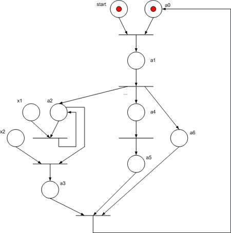
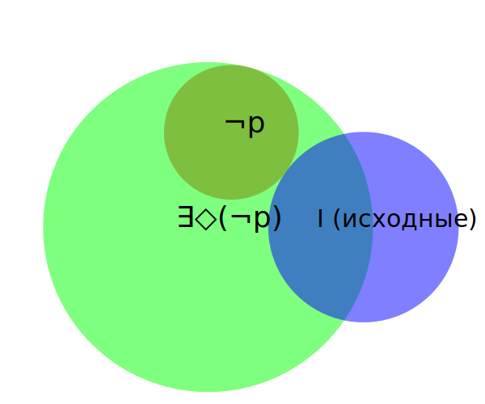
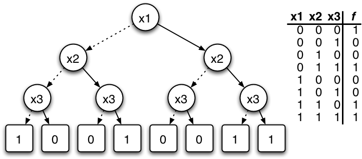
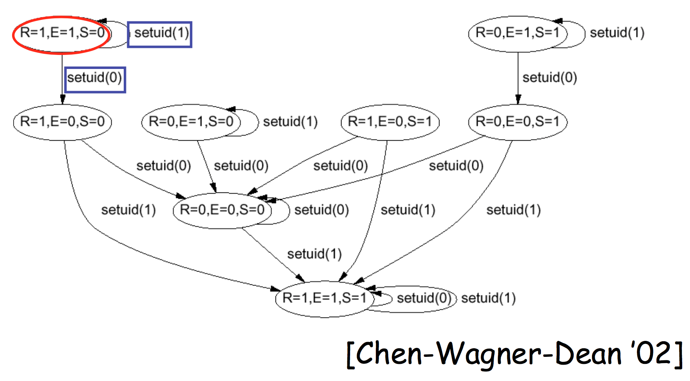

# Математические модели вычислений

## Введение в Model Checking. Темпоральные логики LTL и CTL

## Software Model Checking via Counterexample Guided Abstraction Refinement

maxim.krivchikov@gmail.com

https://maxxk.github.io/formal-models/

# Источники

Классическая книга:
Clarke E.M., Grumberg O., Peled D.A. Model Checking. Cambridge, Mass: The MIT Press, 1999. 314 p.
Э.М. Кларк и др. Верификация моделей программ. Model checking. М.:МЦНМО, 2002.

Презентации:
Bor-Yuh Evan Chang
https://www.cs.colorado.edu/~bec/courses/csci5535/meetings/meeting03.pdf
https://www.cs.colorado.edu/~bec/courses/csci5535/meetings/meeting04.pdf

# Model checking
## Верификация моделей программ
— подход, обеспечивающий выполнение требуемых свойств путём исчерпывающей проверки всего возможного множества состояний.

На настоящее время наиболее успешно используемый на практике подход к формальной верификации программного обеспечения.

# Общие принципы Model Checking
Задача — верификация свойств программ или поиск ошибок в программах.

Автоматизированный подход, который:

- верифицирует модели состояний и переходов,

- обеспечивает выполнение *темпоральных* свойств (свойств, которые формулируются в понятиях «до» и «после» некоторого состояния).

Выполняет фальсификацию гипотезы путём генерации контрпримеров.

### Замечание: Фальсифицируемость

К. Поппер, 1935 г. — один из современных критериев научности теории (гипотезы).

Теория научна, если она удовлетворяет критерию фальсифицируемости — принципиально может быть поставлен тот или иной эксперимент, один из возможных исходов которого опровергает теорию.


# Модели состояний и переходов
Простейший пример — конечные автоматы.

Более сложный — сети Петри:



# Сети Петри
— математический аппарат для описания динамических распределённых систем. Представляет собой ориентированный двудольный (мульти)граф, состоящий из вершин двух типов: позиции (состояния; обозначаются, как правило, окружностями) и переходы (события; обозначаются прямоугольниками).

В позициях может находиться определенное количество фишек. Для активации перехода необходимо, чтобы во всех позициях до перехода было заданное число фишек. Переходы могут активироваться одновременно или по одному; после активации перехода заданное количество фишек переносится из позиции до перехода в позицию после перехода. Переходы могут быть помечены условиями (например, может активироваться только если в предыдущей позиции не менее 5 фишек). 

Применение: анализ конкурентных систем; анализ систем массового обслуживания.

В зависимости от задачи, можно исследовать, например: достижимость одной позиции из другой; ограничения на обрабатываемый поток; корректность синхронизации процессов.

# Сети Петри: примеры
Моделирование энергосетей на солнечной энергетике: 
https://solar-nets.herokuapp.com/

Web-визуализатор: http://kaukeb.github.io/petri-nets/
Один из OpenSource-редакторов: http://www.pneditor.org/  

# Темпоральная логика
<style>
section table {
    margin-left: 1em;
}
table {
    border-collapse: collapse;
    border-spacing: 0;
    empty-cells: show;
    border: 1px solid #cbcbcb;
}
td,
th {
    border-left: 1px solid #cbcbcb;/*  inner column border */
    border-width: 0 0 0 1px;
    font-size: inherit;
    margin: 0;
    overflow: visible; /*to make ths where the title is really long work*/
    padding: 0.5em 1em; /* cell padding */
}

/* nth-child selector for modern browsers */
tr:nth-child(2n-1) td {
    background-color: #f2f2f2;
}
td {
    border-bottom: 1px solid #cbcbcb;
}
tbody > tr:last-child > td {
    border-bottom-width: 0;
}
</style>
## Обычные логические операторы

  Оператор  |  Описание  |  Значения
---------------+---------------+-----------------
  ¬ A       | **Не** A   |  ¬0 = 1, ¬1 = 0
  A ∧ B     | A **и** B  |  (0 ∧ 0) = (0 ∧ 1) = (1 ∧ 0) = 0;  (1 ∧ 1) = 1
  A ∨ B     | A **или** B | (0 ∨ 0) = 0; (0 ∨ 1) = (1 ∨ 0) = (1 ∨ 1) = 1
  A → B     | Из A **следует** B | (0 → 0) = (0 → 1) = (1 → 1 )= 1; (0 → 1) = 0

# Темпоральная логика
В темпоральной логике переменные — последовательности логических переменных, т.е. A на самом деле — это множество состояний A~i~ в i-е моменты времени.

  Оператор  |  Описание  |   Диаграмма
---------------+---------------+-----------------
  X α , ◯α  |  α будет верно в **следующем** состоянии | 
  G α , **□** α   |  α верно **во всех следующих** состояниях | 
  F α , **◇** α   |  α будет верно **в одном из следующих** состояний | 
  ε U δ   |  ε верно **до некоторого** состояния, **после которого** становится верно δ | 

  https://en.wikipedia.org/wiki/Temporal_logic

# Темпоральная логика
Позволяет выразить свойства, связанные со временем, такие как «инвариантность» и «гарантированная достижимость».

$α$ — **инвариант** (invariant) для данного состояния $i$, если начиная с этого состояния $α$ выполняется во всех последующих на любом возможном пути исполнения.

$α$ **гарантированно достижимо** (eventual, «когда-нибудь произойдёт») из данного состояния $i$, если на любом пути исполнения начиная с этого состояния  найдётся хотя бы одно состояние, в котором выполняется $α$.

# Пример — параллельная программа {.left}
<style>
.left-column { float: left; }
.right-column { float: right; }
.normalsize { font-size: 1em !important; }
.large { font-size: 1.2em !important; }
.huge  { font-size: 2em !important; }
</style>

- Два процесса выполняются параллельно.
- В общей памяти задана переменная `turn`.
- Общая переменная используется для определения критической секции, в которой в каждый момент времени может находиться только один поток.


``` {.left-column .normalsize} 
10: while(true) {
11:   wait(turn == 0)
    // Критическая секция
12:   work(); turn = 1
13: }
```
``` {.right-column .normalsize}
20: while(true) {
21:   wait(turn == 1)
    // Критическая секция
22:   work(); turn = 0
23: }
```

# Граф достижимых состояний примера
Состояние — все возможные сочетания значения переменной `turn` и счётчиков инструкций двух процессов.
``` {.graphviz .fdp .left-column}
digraph  g {
  node [penwidth=2]
  edge [penwidth=2]
  "t=0,\n10, 20" [pos = "0,5!"];
  "t=1,\n10, 20" [pos = "5,5!"];
  "t=0,\n12, 21" [pos = "0,0!"];
  "t=1,\n11, 22" [pos = "5,0!"];

  "t=0,\n10, 20" -> "t=0,\n10, 21";
  "t=0,\n10, 20" -> "t=0,\n11, 20";
  "t=0,\n10, 21" -> "t=0,\n10, 21";
  "t=0,\n10, 21" -> "t=0,\n11, 21";
  "t=0,\n11, 20" -> "t=0,\n11, 21";
  "t=0,\n11, 20" -> "t=0,\n12, 20";
  "t=0,\n11, 21" -> "t=0,\n11, 21";
  "t=0,\n11, 21" -> "t=0,\n12, 21";
  "t=0,\n12, 20" -> "t=1,\n10, 20";
  "t=0,\n12, 20" -> "t=0,\n12, 21";
  "t=0,\n12, 21" -> "t=0,\n12, 21";
  "t=0,\n12, 21" -> "t=1,\n10, 21";
  "t=1,\n10, 20" -> "t=1,\n10, 21";
  "t=1,\n10, 20" -> "t=1,\n11, 20";
  "t=1,\n10, 21" -> "t=1,\n10, 22";
  "t=1,\n10, 21" -> "t=1,\n11, 21";
  "t=1,\n11, 20" -> "t=1,\n11, 20";
  "t=1,\n11, 20" -> "t=1,\n11, 21";
  "t=1,\n10, 22" -> "t=0,\n10, 20";
  "t=1,\n10, 22" -> "t=1,\n11, 22";
  "t=1,\n11, 21" -> "t=1,\n11, 21";
  "t=1,\n11, 21" -> "t=1,\n11, 22";
  "t=1,\n11, 22" -> "t=1,\n11, 22";
  "t=1,\n11, 22" -> "t=0,\n11, 20";
}
```
```{.right-column .small}
10: while(true) {
11:   wait(turn == 0)
    // Критическая секция
12:   work(); turn = 1
13: }
||
20: while(true) {
21:   wait(turn == 1)
    // Критическая секция
22:   work(); turn = 0
23: }
```

# Модель состояний и переходов {.center}
Напоминает недетерминированный автомат со специальными метками на состояниях:

T = (S, I ⊆ S, R ⊆ S × S, L : S → 2^AP^)

- S — множество состояний (конфигураций)
- I — начальные состояния
- R — переходы
- L — функция аннотаций (labeling function)
- AP — множество атомарных утверждений о программе (например, x=5)
    * описывают основные утверждения
    * для программ обычно — в терминах значений переменных
    * функция аннотаций помечает каждое состояние множеством истинных в этом состоянии атомарных утверждений

# Примеры свойств

1. во всех достижимых конфигурациях системы два процесса *никогда не находятся одновременно в критической секции*
  (`pc1=12`, `pc2=22` — атомарные утверждения «процесс находится в критической секции»)
    `Invariant(¬(pc1 = 12 ∧ pc2=22))`
2. первый процесс *обязательно попадёт* в критическую секцию
    `Eventually(pc1 = 12)`

# Пути исполнения {.center}
**Путь** в модели состояний и переходов — это бесконечная последовательность состояний, последовательно связанных переходами:
$$ (s_0, s_1, s_2, …) \qquad (s_{i}, s_{i+1}) ∈ R $$

**Путь исполнения** — путь, который начинается из начального состояния ($s_0 ∈ I$)

Дополнительно к уже рассмотренным операторам темпоральной логики можно ввести квантификацию по путям (∀ x, ∃ x)

# Отношения выводимости {.center}

В «обычной» логике, как на прошлом занятии:
$A, B, C ⊦ D$ — $D$ выводимо при наличии выводов $A, B, C$.

В темпоральной логике вводится следующее отношение:
$$ h ⊧ p $$
Для пути $h$ выполняется предикат $p$.

Пример (1):
` ∀ h . h ⊧ G (¬ (pc1 = 12 ∧ pc2 = 22)) `

# Linear Time Logic

LTL (Linear Time Logic) — путь рассматривается как линейная последовательность переходов, значение предикатов определено на путях.
```{.graphviz .dot .right-column}
digraph g {
  node   [penwidth=2]
  edge [penwidth=2]
  rankdir="LR";
"t=0\n10,20" -> "t=0\n10,21" -> "t=0\n10,21'" -> "t=0\n11,21" -> "t=0\n11,21'" -> "t=0\n12,21" -> "t=0\n10,21''" -> "...";
}
```

# Computational Tree Logic {.center}
CTL (Computational Tree Logic) — рассматривается дерево всех возможных путей; именно в этой логике используется квантификация по путям.
```{.graphviz .dot}
digraph g {
  node  [penwidth=2]
  edge [penwidth=2]
  "t=0\n10,20" -> "t=0\n10,21";
  "t=0\n10,20" -> "t=0\n11,20";
  "t=0\n10,21" -> "t=0\n10,21'";
  "t=0\n10,21" -> "t=0\n11,21";
  "t=0\n11,20" -> "t=0\n11,21'";
  "t=0\n11,20" -> "t=0\n12,20";
  "t=0\n12,20" -> "t=0\n12,21";
  "t=0\n12,20" -> "t=1\n10,20";
}
```


# Вычислительная сложность
Для множества состояний $S$ и переходов $R$ проверить, удовлетворяет ли модель формуле $f$ можно за время:
$$ O( |f | · (|S| + |R|)) $$

Сложность растёт линейно по отношению к размеру модели состояний и переходов.

Однако размер модели состояний и переходов растёт экспоненциально по отношению к количеству переменных и числу параллельных процессов.

Основная проблема model checking — проблема «комбинаторного взрыва» количества состояний.

# Проверка утверждений с кванторами
## Квантифицированные свойства = неподвижные точки
∀□(p) ≡ ∃◇(¬p) (p — глобальный инвариант = не существует состояния, из которого достижимо другое состояние, в котором p — не выполняется)

Алгоритм:
1. Положим Func : $2^S$ → $2^S$, Func(Z) ≡ ¬p ∪ состояния, из которых Z достижимо за один шаг.
2. Вычислим ∃F(¬p) как наименьшую неподвижную точку Func:
    - начинаем с Z=⊘ , применяем Func, пока не дойдём до неподвижной точки (Func(Z') = Z')

# Неподвижные точки {.center}


# Symbolic Model Checking
## Символьная верификация моделей
- множества состояний и отношение перехода представляются в виде булевых формул
- неподвижные точки можно вычислить итеративной подстановкой в такие формулы
- пример средства — [SMV (Symbolic Model Verifier)](http://www.cs.cmu.edu/~modelcheck/smv.html), выполняет проверку свойств в логике CTL с использованием бинарных диаграмм решений (Binary Decision Diagrams, BDD)
- BDD используются для представления множества в виде функции принадлежности

# Binary Decision Diagrams
## Бинарные диаграммы решений
  

# Binary Decision Diagrams
- дизъюнкция и конъюнкция формул вычисляется не более чем за квадратичное время
- отрицание — за константное время (очевидно — поменяем местами 0 и 1)
- проверка эквивалентности формул — константа или линейное время
- образ (выполнимость; множество всех значений переменных, при которых формула выполняется) — может быть экспоненциальным

# Software Model Checking via Counterexample Guided Abstraction Refinement (SLAM)

## приблизительно — «Верификация моделей программ с использованием абстракции и уточнения по контрпримерам»

Реализация — анализатор [BLAST (Berkeley Lazy Abstraction Software verification Tool)](http://forge.ispras.ru/projects/blast), разработан в Беркли; на настоящее время поддерживается в России, в ИСП РАН.

[Статья с примером работы BLAST](http://www.sosy-lab.org/~dbeyer/Publications/2004-SAS.The_Blast_Query_Language_for_Software_Verification.pdf)

# Общие принципы SLAM
1. **Входные данные**
    - программа (на языке C!)
    - частичная спецификация (задаётся в виде модели состояний и переходов, более-менее в терминах атомарных утверждений — «программа использует блокировки корректно», а не «программа реализует Web-сервер»)
2. **Выходные данные**
    - программа удовлетворяет спецификации (в некоторых случаях возможно получить доказательство)
    - есть контрпример — конкретный путь исполнения программы, нарушающий спецификацию
3. **Схема работы**
    - преобразуем программу в набор формул алгебры логики («булевскую программу»)
    - проверяем выполнение спецификации
    - нет ошибок в булевской программе — значит нет ошибок в оригинальной
    - возможны ложные положительные

# Свойство 1 — двойная блокировка {.center}
``` {.graphviz .fdp}
digraph g {
  node [penwidth=2]
  edge [penwidth=2]
  style="filled";
  W [ fillcolor="white", fontcolor=white, label="", style="filled", pos = "0,2!" ]
  B [ fillcolor="black", label="", style="filled", pos = "2,2!" ]
  R [ fillcolor=red, fontcolor=red, label="", style="filled", pos="1,0!"]

  W -> B [label="lock"];
  B -> W [label="unlock"];

  W -> R [label="unlock"];
  B -> R [label = "lock"];
}
```
Повторный вызов `lock` или `unlock` приводит к deadlock.

Свойство: вызовы `lock` и `unlock` должны чередоваться.

# Свойство 2
## понижение привилегий суперпользователя
Произвольные пользовательские приложения не должны быть запущены с привилегиями суперпользователя. Свойство: при вызове `execv` всегда `suid ≠ 0`.


# Псевдокод SLAM
```
SLAM(Program p, Spec s) =
    Program q = incorporate_spec(p,s);
    PredicateSet abs = { };
    while true do
        BooleanProgram b = abstract(q,abs);
        match model_check(b) with // используются внешние инструментальные средства
            | No_Error ⇒ print(“no bug”); exit(0)
            | Counterexample(c) ⇒
                if is_valid_path(c, p) then
                    print(“real bug”); exit(1)􏱰
                else
                    abs ← abs ∪ new_preds(c)
    done
```

Чуть подробнее (на английском языке) — по второй ссылке на втором слайде.

# Инструментальные средства: SAT-решатели
Задача выполнимости булевских формул (Boolean Satisfiability Problem, SAT) — по данной (сложной, с большим количеством переменных) формуле алгебры логики определить,  существует ли такой набор переменных, что при подстановке формула принимает истинное значение. 

Эта задача **разрешима**, но принадлежит к классу сложности **NP.** Есть алгоритм, который решает задачу (полный перебор), но для интересных на практике формул он имеет недопустимо большую (экспоненциальную по числу переменных) сложность. Более того, задача SAT **NP-полна,** т.е. любая задача из класса **NP** сводится к SAT за полиномиальное время (полином постоянной степени от размера задачи; это значит «относительно быстро»).

На практике используются эвристические алгоритмы, в которых на основе тех или иных соображений постепенно снижается мощность множества для перебора.

http://www.satcompetition.org/ — сравнение эвристических SAT-решателей в форме состязания.

# SMT-решатели
SAT-решатели оперируют формулами алгебры логики, а на практике часто хочется работать с более выразительными системами (хотя бы с логикой первого порядка).

Задача выполнимости формул в теориях (satisfiability modulo theories) — по данной формуле в терминах логики первого порядка с равенством и набором некоторых условий первого порядка на предикатные и функциональные символы определить, существует ли такой набор переменных, что при подстановке формула принимает истинное значение в любой сигнатуре, удовлетворяющей условиям.

Может использоваться как в методах model checking наподобие SLAM, так и в компьютерной матматике, для получения доказательств или контрпримеров к теоремам.

Один из популярных SMT-решателей на настоящее время — Z3 от Microsoft Research (https://github.com/Z3Prover/z3).

http://www.rise4fun.com/iZ3/even_odd
http://www.rise4fun.com/iZ3/tutorial/guide

# Выводы
- Model checking — хороший, работающий на практике подход
- Проблема экспоненциального взрыва состояний
- Проблема абстракции и уточнения
- Главная (на мой взгляд) проблема — очень низкоуровневое описание свойств

Обычно хочется всё-так доказывать свойства вида «эта программа — web-сервер, понимающий стандарт HTTP 1.1», а лучше даже — «этот комплекс программ реализует сайт, на котором обычный пользователь не может получить доступ к закрытым от него данным». Это не всегда возможно, но нужно стремиться к этому.


# Задачи
  
**Задача 4.1а\*** Вручную перевести реализацию одного из алгоритмов сортировки (быстрая сортировка, сортировка слиянием, пирамидальная сортировка, пузырьковая сортировка) в терминах SMT-решателя (например, Z3) и попытаться проверить корректность реализации.

**Задача 4.1б\*\*** Аналогично — для поразрядной сортировки (radix sort).

**Задача 4.2\*\*** Представить пример доказательства не совсем тривиального свойства для не совсем тривиальной программы на используемых на практике языках программирования :) (> 40 строк кода без учёта комментариев и пустых строк) с использованием BLAST или [других](https://en.wikipedia.org/wiki/List_of_model_checking_tools) средств model checking. 

Требуется самостоятельно установить одно из средств model checking, просмотреть документацию по нему, расширить приведённые примеры (или придумать свой) и написать мини-отчёт объёмом от 1000 букв текста на русском языке. 

Например, интересно было бы проверить корректность тех же реализации сортировки.


