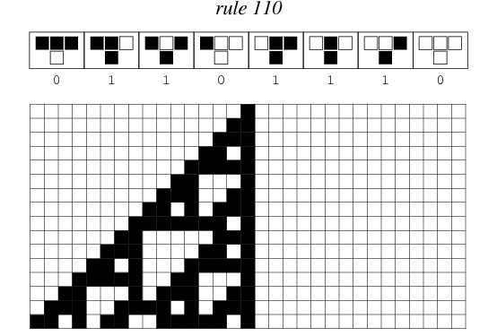

# Математические модели вычислений

## Альтернативные модели вычислений

### Клеточные автоматы
### Понятие «Тьюринг-полноты» в компьютерных языках
### μ-рекурсивные функции Клини
### Теория доменов Скотта-Ершова

#### maxim.krivchikov@gmail.com

#### https://maxxk.github.io/formal-models/

# Клеточный автомат

Решётка («таблица» произвольной размерности) из ячеек, каждая из которых может находиться в конечном числе состояний.

На каждом шаге следующее состояние каждой ячейки определяется по заданному фиксированному правилу, которое может использовать текущее состояние ячейки и текущие состояния ячеек в некоторой окрестности.

Более строго:
1. Пространство ячеек C.
2. Конечный набор возможных состояний ячеек — Σ, |Σ| = k; ∀ c ∈ C, σ(c) ∈ Σ.
3. Понятие окрестности ячейки — N(c) — конечное множество ячеек из C. Для всех ячеек окрестность имеет один и тот же размер |N(c)| = n. Окрестность «взаимна» — для каждой ячейки d из окрестности ячейки c, c ∈ N(d).
4. Правило перехода φ : Σ^n^ → Σ.

На каждом шаге t правило перехода одновременно применяется к каждой ячейке с состояниями окрестности на предыдущий момент времени t-1. 

# Типы поведения автоматов
Классификация правил перехода Вольфрама:

**Класс 1.** Быстрая стабилизация состояния и его гомогенность.
**Класс 2.** Быстрая стабилизация состояния либо возникновение колебаний. Локальные изменения в начальных условиях оказывают локальный характер на дальнейший ход эволюции системы.
**Класс 3.** Почти все начальные условия приводят к псевдо-случайным последовательностям, стабильные структуры почти сразу уничтожаются окружающим шумом. 
**Класс 4.** Результатом эволюции почти всех начальных состояний являются структуры, которые взаимодействуют сложным образом с формированием локальных, устойчивых структур, которые способны сохраняться длительное время.

Некоторые клеточные автоматы демонстрируют поведение, достаточное для эмуляции машины Тьюринга.

# Тьюринг-эквивалентные клеточные автоматы
1. [Игра «Жизнь» Конвэя](http://www.igblan.free-online.co.uk/igblan/ca/) ([и ещё одна схема](http://www.rendell-attic.org/gol/fullutm/index.htm))
2. «Rule 110» — одномерный клеточный автомат

# Rule 110
Из Wolfram MathWorld: http://mathworld.wolfram.com/Rule110.html

# Понятие «Тьюринг-полноты» в компьютерных языках

# Машины с регистрами
Машина с регистрами включает:
1. Неограниченное (как правило, конечное) количество именованных регистров, каждый из которых может содержать одно неотрицательное число неограниченного размера.
2. Набор меток.
3. Ограниченный набор инструкций, который может включать:
    1. Арифметические инструкции (Increment(r), Decrement(r), Clear-to-zero(r), Load-constant(r, k), Add, Subtract, ...)
    2. Управляющие инструкции (Copy(r~1~, r~2~), LoadAccumulator(r), StoreAccumulator(r))
    3. **Условный переход** (обязательно; как правило, по заданному регистру): Jump-if-zero, Jump-if-not-zero, Jump-if-equal, ...
    4. Операции непрямой адресации (Load-from-address(r), Store-by-address(r))
    5. Ввод-вывод
4. Регистр состояний — содержит текущую инструкцию и её адрес в программе.
5. Список инструкций с метками (как правило, последовательный).

Классы: машины со счётчиками, машины с указателями, машины с памятью с произвольным доступом, машины с памятью с произвольным доступом с программой в регистрах (архитектура фон Неймана)

# «Аппаратные» реализации

1. URISC (Ultimate Restricted Instruction Set Computer) — машина с одной инструкцией. Для того, чтобы иметь возможность эмулировать машину Тьюринга, память должна быть бесконечной, а адреса и ячейки — произвольными целыми числами (возможно, неотрицательными)
    - `subleq a, b, c` — посчитать `M[b] - M[a]`, записать в `M[b]` и перейти на адрес `c`. В памяти хранятся тройки `a, b, c`
    - `dln a, b` — уменьшить на 1 значение `M[a]`; если получился `0`, перейти по адресу `b`

2. Механизм защиты памяти в x86-процессорах допускает реализацию `subleq` с помощью вложенных исключений page fault

3. Magic: The Gathering (и другие примеры на странице [Accidentally Turing-complete](http://beza1e1.tuxen.de/articles/accidentally_turing_complete.html))

# μ-рекурсивные функции Клини

# Частичные функции

# Теория доменов Скотта-Ершова

# Частично упорядоченные множества

# Домены

# Монотонность и непрерывность

# Непрерывные функции в вычислениях

# Литература

Клеточные автоматы: Stephen Wolfram. A New Kind of Science. Wolfram Media, Inc. 2007

# Задачи

**Задача 9.1\*\*\***
~ предложите возможные способы задания системы типов, не допускающей задание незавершимых функций, для клеточных автоматов или для μ-рекурсивных функций Клини (текст, от 5 страниц A4, шрифт 14пт, междустрочный интервал 1.5). 